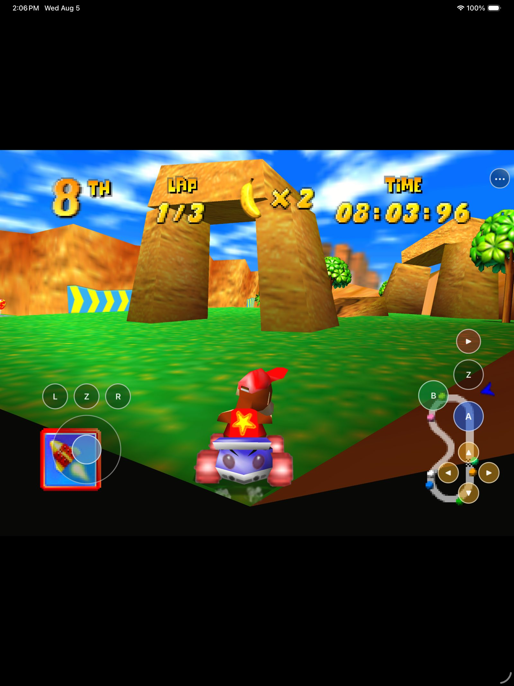
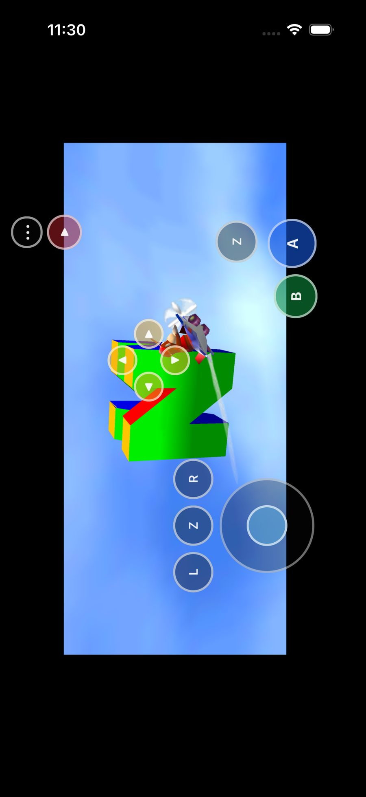
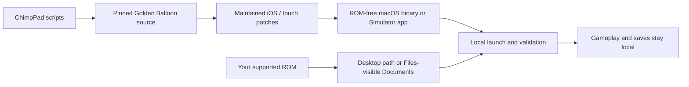

# ChimpPad

<p align="center">
  <strong>Diddy Kong Racing on Mac, iPhone, and iPad—with grip-first touch controls.</strong><br>
  Native WebGPU/Metal host, SpaghettiPad-inspired overlays, and a
  bring-your-own-ROM workflow.
</p>

<p align="center">
  
  
  
  
  
  
</p>



ChimpPad is a native Apple shell around the open-source
[Golden Balloon](https://github.com/akratch/goldenballoon) port of
[Diddy Kong Racing](https://github.com/davidsm64/diddy-kong-racing). It reuses
[SpaghettiPad](https://github.com/chrissotraidis/spaghettipad) patterns for
lifecycle, virtual N64-style input, safe-area touch layouts, and README/docs
structure—but **maps controls for Diddy Kong Racing**, not Mario Kart 64.

This repository contains the Apple integration, maintained host patches,
reproducible build scripts, and documentation. It does **not** contain the
Diddy Kong Racing ROM, extractable or playable Nintendo/Rare game assets, or
any redistributable game archive. Gameplay screenshots are retained only as
documentation. Read the scoped [ROM policy](docs/ROM_POLICY.md). This is a
source-available integration repository, not a redistributable game package.

## Built for racing on glass

The touch layout keeps the controls under your thumbs and the race visible.
The left side puts **L**, **Z**, and **R** above a full-analog stick. The right
side keeps a second **Z** above **A** and **B**, with Start deliberately
separated from the action cluster and the camera C-pad nearby.

Touch is not painted over the whole display: empty space still belongs to the
game, the glass chrome stays semi-transparent, and the persistent `•••` button
always provides a way back to the host shell menu.

## Current screenshots

<table>
  <tr>
    <td width="50%">
      
    </td>
    <td width="50%">
      
    </td>
  </tr>
  <tr>
    <td align="center"><strong>Every race control, within reach</strong><br>Hold A, steer with full analog input, hop with R, and fire items from either Z.</td>
    <td align="center"><strong>Phone and tablet layouts</strong><br>Compact phone grip and tablet rail layouts share the same DKR mapping and P1 inject path.</td>
  </tr>
</table>

These are current Simulator captures using locally supplied game data. The ROM
used to create them is not part of this repository. See
[docs/screenshots/README.md](docs/screenshots/README.md).

## Install status

| Option | Status | What to do |
|---|---|---|
| Local macOS build | **Available now** | Build with [scripts/build-macos.sh](scripts/build-macos.sh) and launch with your ROM. |
| iPhone Simulator | **Available now** | Build/run with `scripts/build-ios.sh --simulator` and `scripts/run-ios-sim.sh phone`. |
| iPad Simulator | **Available now** | Same binary; use `scripts/run-ios-sim.sh pad`. Only one Simulator at a time. |
| Physical iPhone / iPad | **Out of scope** | Device signing and hardware acceptance are not part of this milestone. |
| App Store / TestFlight | **Not announced** | No App Store listing or public TestFlight exists. |

macOS, iPhone Simulator, and iPad Simulator have all reached **in-race**
gameplay with scripted or touch input. That does not certify every track,
vehicle, or control feel configuration. Physical-device play remains an explicit
future gate.

## Get started

You need:

- a Mac with Xcode and its command-line tools;
- [Homebrew](https://brew.sh);
- `cmake`, `ninja`, `pkgconf`, and `make`; and
- your own legally acquired **Diddy Kong Racing** ROM (`.z64` / `.v64` / `.n64`).

Golden Balloon supports **US 1.1** and **European 1.1**. This workspace's local
reference dump is a **US 1.1 V64** file under gitignored `ref/` storage.

Expected local dump fingerprint:

```text
SHA-1 03f04dfe0c34e8bad370aa4b68f4bb8ed3429fde
```

Install the host dependencies:

```sh
brew install cmake ninja pkgconf make
```

Clone and build:

```sh
git clone https://github.com/chrissotraidis/chimppad.git
cd chimppad
scripts/clone-refs.sh          # decomp + goldenballoon pins into ref/
scripts/build-macos.sh         # builds mdkr64 + unit tests
scripts/run-macos.sh --rom "/path/to/your.v64"
```

### iOS / iPadOS Simulator

```sh
scripts/build-ios.sh --simulator --device-family phone
scripts/run-ios-sim.sh phone    # or: pad
# Only one Simulator at a time
```

The run script installs the app, copies a local ROM into the app Documents
container when available, and launches with touch-preserving autoplay so the
overlay stays live. Never embed the ROM in the committed tree.

See [the complete build guide](docs/BUILDING.md) for prerequisites, patch
application, and diagnostic host builds.

## First launch

ChimpPad never downloads or bundles game data.

### macOS

1. Build with `scripts/build-macos.sh`.
2. Launch with `scripts/run-macos.sh --rom "/absolute/path/to/your.v64"`.
3. Or open the Golden Balloon / `mdkr64` launcher and choose the ROM there.

### iPhone / iPad Simulator

1. Build with `scripts/build-ios.sh --simulator`.
2. Run `scripts/run-ios-sim.sh phone` or `... pad`.
3. If you are not using the automatic ROM copy path, place your ROM in the
   app's Files-visible Documents container as `diddy-kong-racing.v64`.
4. Keep the app open while it boots DKR with the touch overlay active.

The ROM and any local saves remain in the app container or desktop working
directory. They are ignored by Git and rejected by repository safety checks.

## Touch controls

The current controller is arranged for landscape play and follows SpaghettiPad's
grip-first defaults, remapped for Diddy Kong Racing:

- **Left:** L, Z, and R above the full-analog control stick.
- **Right:** Z above A and B, plus Start and the four C buttons.
- **Menu:** the persistent `•••` button opens the host shell menu.
- **Layouts:** separate phone compact and tablet rail layouts.
- **Feel:** glass alpha chrome, 50 ms minimum press, stick grab radius larger
  than the drawn ring, and race-only A hold assist.

The touch D-pad is intentionally omitted because normal DKR racing does not
need it. Hold A for 0.65 seconds during a race, then lift your finger to keep
accelerating; the `A •` label and a short haptic confirm the hold. Tap A again
to release it. Z and R always remain momentary.

Empty center space still belongs to the game. See
[Touch controls](docs/TOUCH_CONTROLS.md) for layout math, inject path, and
current validation.

| Touch control | Diddy Kong Racing action |
|---|---|
| Analog stick | Steer / menu navigate |
| A | Accelerate / confirm; race-only hold assist |
| B | Brake, reverse / cancel |
| Z (left or right) | Item / special |
| R | Hop / power-slide |
| L | Secondary / camera context |
| Start | Pause / start |
| C buttons | Camera |
| `•••` | Open or close the host shell menu |

Keyboard defaults match Golden Balloon: `X` accel, `Z` brake, `Space` hop,
`Shift` item, arrows/WASD stick, `IJKL` C-buttons, Enter Start.

## Desktop and Simulator host

ChimpPad is not a general N64 emulator shell. Game logic runs as compiled host
code through Golden Balloon (`mdkr64`). ChimpPad supplies:

- Apple packaging and lifecycle
- ROM discovery and the legal boundary for local game data
- SpaghettiPad-inspired virtual controller and touch overlays
- DKR-specific button mapping and phone/tablet layouts
- Active runtime logging for diagnosis (`[ChimpPad]`, host `[mdkr64]` / `[webgpu]`)

The matching decompilation under `ref/diddy-kong-racing` remains a reference
for control semantics and future sync. It is not the runtime play host.

## Current validation

| Area | Current result |
|---|---|
| macOS host | Builds and boots DKR; official TT route reaches race (`levelId=5`) with moving racer |
| iPhone Simulator | Documents ROM + autoplay reach in-race play with phone touch overlay |
| iPad Simulator | Same route reaches in-race play with tablet overlay and advancing race state |
| Touch inject | Shell → `platform_ios_touch_set` → P1 fixed-tick merge; dual Z and A hold assist present |
| Rendering | WebGPU → Metal on macOS and Simulator GPU path |
| Physical device | Out of scope for this milestone |
| Packaging | ROM-free source tree and scripts; no App Store / TestFlight path yet |
| Unit tests | Pure stick/layout/mapping helpers pass via `scripts/test-unit.sh` |

The project deliberately keeps build, Simulator, process, and physical-device
evidence separate. See [docs/STATUS.md](docs/STATUS.md),
[docs/EVIDENCE.md](docs/EVIDENCE.md), and [docs/HANDOFF.md](docs/HANDOFF.md).

## Supported game

| Game | Engine | Status |
|---|---|---|
| **Diddy Kong Racing US 1.1** | [Golden Balloon](https://github.com/akratch/goldenballoon) | Supported host path |
| **Diddy Kong Racing European 1.1** | Golden Balloon | Supported by host |
| Other Nintendo 64 games or ROM revisions | Other ports/emulators | Not supported by this app |

ChimpPad is a native integration of one source port, not a general Nintendo 64
emulator. A different game or unsupported revision cannot be substituted.

## Reproducible and ROM-free



The normal compile never reads your ROM. Build scripts fetch or patch host
sources, produce a ROM-free product, and leave game data introduction for
runtime only.

Before sharing a source snapshot, run:

```sh
scripts/check-repo-safety.sh
```

## Frequently asked questions

<details>
<summary><strong>Does this repository include Diddy Kong Racing?</strong></summary>

No. You must provide your own legally acquired supported ROM. Do not open
issues requesting game data, extracted assets, or download links. See
[docs/ROM_POLICY.md](docs/ROM_POLICY.md).
</details>

<details>
<summary><strong>Is this just SpaghettiPad with a different ROM?</strong></summary>

No. SpaghettiPad integrates SpaghettiKart / Mario Kart 64. ChimpPad integrates
Golden Balloon / Diddy Kong Racing. The Apple shell, grip layout, logging, and
docs structure are intentionally SpaghettiPad-inspired, but the host, mapping,
and game behavior are DKR-specific.
</details>

<details>
<summary><strong>Can I play on a physical iPhone or iPad yet?</strong></summary>

Not as a supported milestone. Simulator builds are the current mobile path.
Physical-device signing, provisioning, and hardware acceptance remain future
work.
</details>

<details>
<summary><strong>Does ChimpPad require JIT or a jailbreak?</strong></summary>

No. It is a native arm64 host build of Golden Balloon with an Apple shell.
Gameplay does not require JIT.
</details>

<details>
<summary><strong>Is this an App Store or TestFlight release?</strong></summary>

No. App Store and TestFlight distribution should not be implied until that
exact path is published and tested.
</details>

<details>
<summary><strong>What is the licensing status?</strong></summary>

- ChimpPad integration code: see repository license when published
- Golden Balloon first-party code: MIT (`ref/goldenballoon/LICENSE`)
- Decomp: see `ref/diddy-kong-racing/LICENSE.md`
- SpaghettiPad: reference patterns only
- Nintendo / Rare game data: **not included**; user-supplied only

No project grant covers Nintendo material.
</details>

## Project map

| Path | Purpose |
|---|---|
| [`scripts/build-macos.sh`](scripts/build-macos.sh) | Desktop host + unit tests |
| [`scripts/run-macos.sh`](scripts/run-macos.sh) | Launch desktop build with a local ROM |
| [`scripts/build-ios.sh`](scripts/build-ios.sh) | iOS / iPadOS Simulator app build |
| [`scripts/run-ios-sim.sh`](scripts/run-ios-sim.sh) | Install, seed ROM, and launch one Simulator |
| [`scripts/apply-ios-patches.sh`](scripts/apply-ios-patches.sh) | Replay maintained host patches |
| [`scripts/check-repo-safety.sh`](scripts/check-repo-safety.sh) | ROM / asset safety gate |
| [`scripts/test-unit.sh`](scripts/test-unit.sh) | Stick/layout/mapping unit tests |
| [`ios/`](ios/) | UIKit shell, ROM boot helpers, touch overlay |
| [`src/`](src/) | Pure layout/mapping helpers |
| [`patches/`](patches/) | Reviewable host changes |
| [`docs/BUILDING.md`](docs/BUILDING.md) | Full build guide |
| [`docs/TOUCH_CONTROLS.md`](docs/TOUCH_CONTROLS.md) | DKR touch mapping and layouts |
| [`docs/STATUS.md`](docs/STATUS.md) | Target-by-target status |
| [`docs/EVIDENCE.md`](docs/EVIDENCE.md) | Test evidence ledger |
| [`docs/HANDOFF.md`](docs/HANDOFF.md) | Current working state and next task |
| [`docs/ROM_POLICY.md`](docs/ROM_POLICY.md) | Legal boundary for game data |
| [`docs/screenshots/`](docs/screenshots/) | Documentation captures |

Generated source trees, builds, artifacts, ROMs, extracted assets, device
evidence outside `docs/`, and signing identifiers are ignored and must never be
committed.

## Contributing

1. Keep ROMs and extracted assets out of git (`scripts/check-repo-safety.sh`)
2. Prefer small, focused commits
3. Update `docs/` in the same change when behavior or status shifts
4. Run `scripts/test-unit.sh` before claiming input/layout changes

## Credits and legal

ChimpPad exists because of
[Golden Balloon](https://github.com/akratch/goldenballoon),
the [Diddy Kong Racing decompilation](https://github.com/davidsm64/diddy-kong-racing),
and the Apple-shell patterns proven in
[SpaghettiPad](https://github.com/chrissotraidis/spaghettipad).

ChimpPad is an unofficial community project and is not affiliated with or
endorsed by Nintendo or Rare. Diddy Kong Racing and related names are trademarks
of their respective owners. All projects, copyrights, and trademarks belong to
their respective owners.
