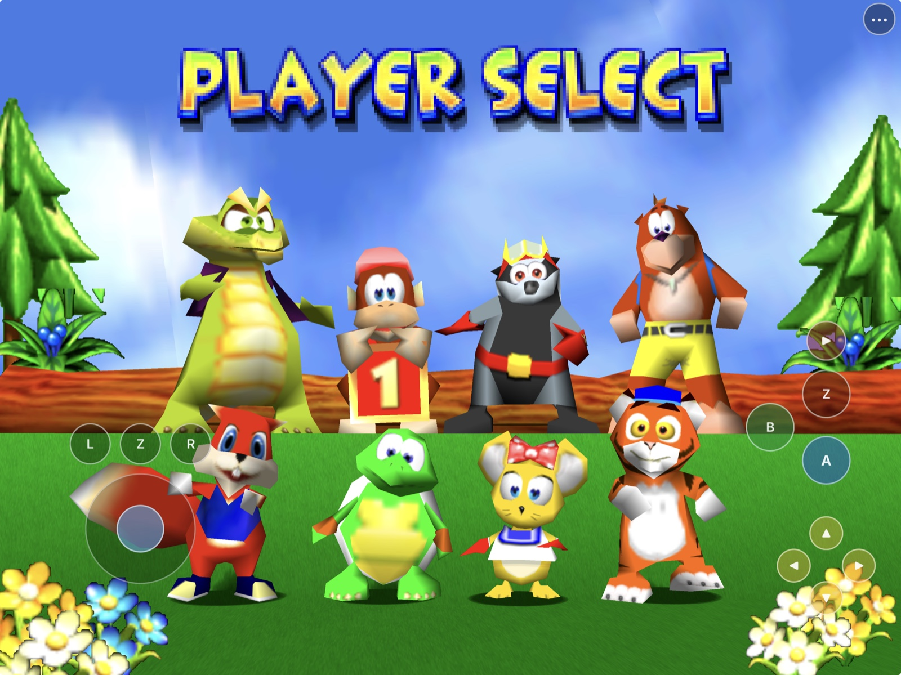
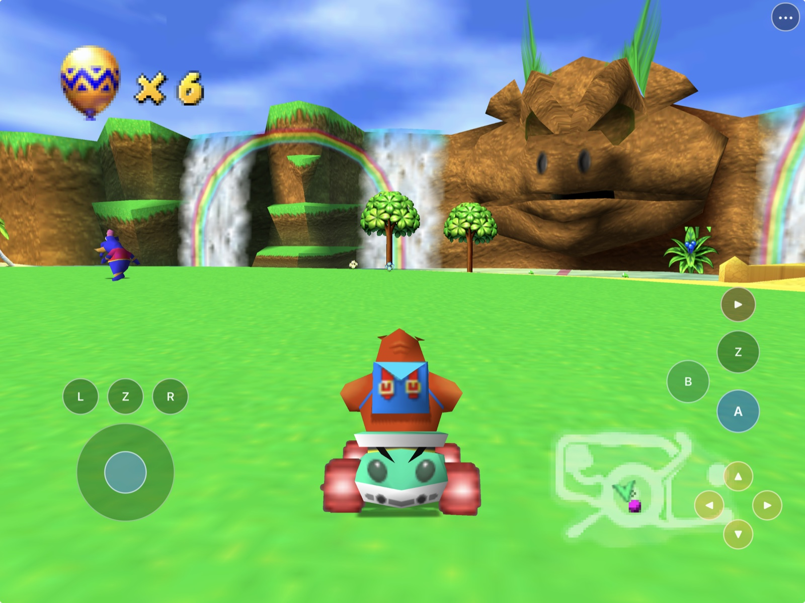
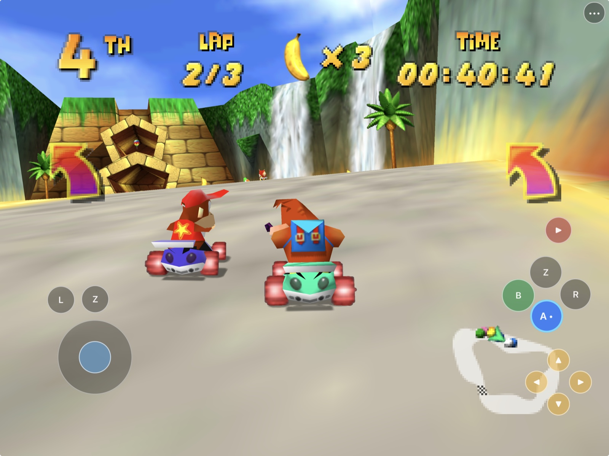
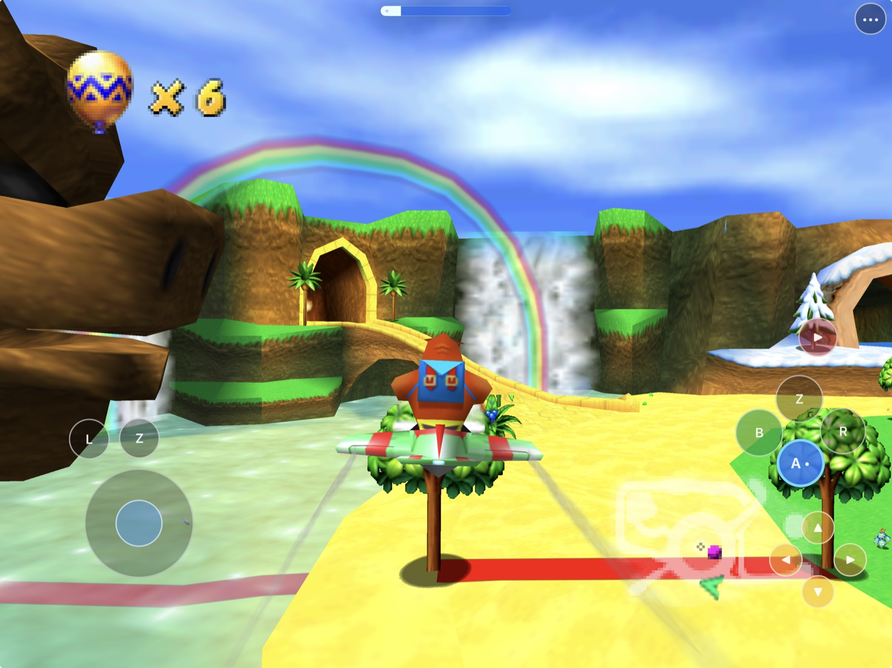
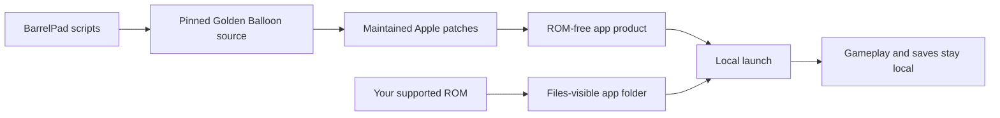

# BarrelPad

<p align="center">
  <strong>Diddy Kong Racing, rebuilt for Mac, iPhone, and iPad.</strong><br>
  Native WebGPU/Metal rendering, customizable touch controls, Files-based game
  data, and a bring-your-own-ROM workflow.
</p>

<p align="center">
  
  
  
  
  
</p>

<p align="center">
  
  <br>
  <sub>BarrelPad running on iPad with the native touch controller active.</sub>
</p>

BarrelPad packages the open-source
[Golden Balloon](https://github.com/akratch/goldenballoon) port of
[Diddy Kong Racing](https://github.com/davidsm64/diddy-kong-racing) as a native
Apple app. It adds iPhone and iPad lifecycle support, a racing-focused touch
controller, editable phone and tablet layouts, and local ROM discovery.

This repository contains the Apple integration, maintained host patches,
build scripts, and documentation. It does **not** contain a Diddy Kong Racing
ROM, extracted Nintendo/Rare assets, or a playable game archive. See the
[ROM policy](docs/ROM_POLICY.md) and
[rights and licensing boundary](RIGHTS_AND_LICENSES.md).

## Install status

| Option | Status | What to do |
|---|---|---|
| Local macOS build | **Available now** | Build with `scripts/build-macos.sh`, then launch with your supported ROM. |
| iPhone / iPad Simulator | **Available now** | Build with `scripts/build-ios.sh --simulator`, then run `scripts/run-ios-sim.sh phone` or `pad`. |
| Physical iPhone / iPad | **Tested locally** | Build an unsigned device app with `scripts/build-ios.sh --device`, then sign it with your Apple development identity and provisioning profile. |
| Public `.ipa` | **Preview 2 available** | Download the [ROM-free unsigned IPA](https://github.com/chrissotraidis/barrelpad/releases/download/v0.1.0-preview.2/BarrelPad-0.1.0-preview.2-unsigned.ipa), then re-sign it for your device. |
| App Store / TestFlight | **Not announced** | No App Store listing or public TestFlight exists. |

The current development build has been signed, installed, launched, and played
on an iPhone 14 and a 12.9-inch iPad Pro. Native landscape rendering, local ROM
boot, touch gameplay, editable controls, settings scrolling, save files, and
in-place updates have been exercised on both device classes.

## Get started

You need:

- a Mac with Xcode and its command-line tools;
- [Homebrew](https://brew.sh);
- `cmake`, `ninja`, `pkgconf`, and `make`;
- an Apple development identity for physical-device installs; and
- your own legally acquired, supported Diddy Kong Racing ROM.

Install the host dependencies:

```sh
brew install cmake ninja pkgconf make
```

Clone and build:

```sh
git clone https://github.com/chrissotraidis/barrelpad.git
cd barrelpad
scripts/clone-refs.sh

# macOS
scripts/build-macos.sh

# iPhone / iPad Simulator
scripts/build-ios.sh --simulator

# Unsigned physical-device app
scripts/build-ios.sh --device

# Audited, ROM-free, re-signable IPA
scripts/package-ios.sh build-ios-device/BarrelPad.app \
  dist/BarrelPad-0.1.0-preview.2-unsigned.ipa
```

The iOS products are written to `build-ios-sim/BarrelPad.app` and
`build-ios-device/BarrelPad.app`. Physical-device installation requires a
matching bundle identifier, provisioning profile, and local signature.

See the [complete build guide](docs/BUILDING.md) for source pins, signing
boundaries, and diagnostic builds.

## First launch

BarrelPad never downloads or bundles game data.

### iPhone and iPad

1. Launch BarrelPad once so iOS creates its Files-visible folder.
2. Open **Files → On My iPhone/iPad → BarrelPad**.
3. Copy a supported ROM into that folder as `diddy-kong-racing.v64`.
4. Return to BarrelPad. The app discovers the ROM and starts the native host.

The ROM, preferences, and saves remain inside the app container. They are
ignored by Git and rejected by the repository safety check.

### macOS

```sh
scripts/run-macos.sh --rom "/absolute/path/to/your.v64"
```

## Touch controls

BarrelPad uses separate landscape defaults for each device class:

- **iPhone:** the accepted compact grip layout keeps steering at bottom-left,
  L/Z near the left thumb, and the face, shoulder, Start, and camera controls
  within right-thumb reach.
- **iPad:** the larger tablet rail layout remains the default, with L/Z/R above
  the analog stick and the action/C-button groups on the right.
- **Menu:** `•••` always remains available. Its first screen exposes
  **Touch Controls** directly, with **All Settings** beside it on both iPhone
  and iPad.
- **Visibility:** **Show gameplay touch controls** explicitly turns the racing
  overlay on or off and remembers the choice.
- **Controller takeover:** a physical Player 1 controller automatically hides
  gameplay touch controls without changing the saved preference. Disconnecting
  it restores touch controls when they were enabled. SDL2 ownership is
  reconciled after hot-plug, foreground resume, and a bounded active check, so
  a stale handle cannot keep Player 1 or held input after sleep/disconnect.
- **Quick sizing:** the Touch Controls page provides 1x–4x presets.
- **Individual editing:** choose **Move & Resize Controls**, select any control,
  drag it, and use the size slider to resize that control alone. **Done** saves
  the device-class layout and restores gameplay input.
- **Complete settings:** both device classes provide separate **Touch Controls**
  and **All Settings** views; the complete list remains vertically scrollable.

| Touch control | Diddy Kong Racing action |
|---|---|
| Analog stick | Steer / menu navigation |
| A | Accelerate / confirm; race-only hold assist |
| B | Brake / reverse / cancel |
| Z (left or right) | Item / special |
| R | Hop / power-slide |
| L | Secondary / camera context |
| Start | Pause / start |
| C buttons | Camera |
| `•••` | Open or close host menu |

Hold A for 0.65 seconds during a race, then lift your finger to keep
accelerating. Tap A again to release it. Z and R remain momentary.

See [Touch controls](docs/TOUCH_CONTROLS.md) for the mapping and input path.

## Screenshots

| Adventure hub | Racing |
|---|---|
|  |  |

<p align="center">
  <strong>Overworld flight</strong><br>
  
</p>

## What works

| Area | Current result |
|---|---|
| Native app | Builds for Apple silicon macOS, iOS Simulator, and arm64 iPhone/iPad devices |
| Rendering | WebGPU through Metal; native widescreen landscape on iPhone and iPad |
| Game setup | Files-visible, user-supplied ROM discovery and native game boot |
| Touch | Full racing controls, persisted visibility, presets, per-control movement and sizing |
| Controllers | SDL2 stable slots; stale-handle release; Player 1 reclaim after sleep/disconnect; foreground reconciliation |
| Settings | Direct touch/all-settings access and vertical scrolling on iPhone and iPad |
| Saves | EEPROM saves and in-place app updates preserving app-container data |
| Packaging | Audited ROM-free Preview 2 IPA with privacy manifest, rights, and third-party notices |

Detailed target evidence lives in [docs/STATUS.md](docs/STATUS.md) and
[docs/EVIDENCE.md](docs/EVIDENCE.md).

## Supported game

| Game | Engine | Status |
|---|---|---|
| **Diddy Kong Racing US 1.1** | [Golden Balloon](https://github.com/akratch/goldenballoon) | Supported and physically tested |
| **Diddy Kong Racing European 1.1** | Golden Balloon | Supported by the host; not physically validated in this repository |
| Other games or ROM revisions | Other ports/emulators | Not supported by BarrelPad |

BarrelPad is a native integration for one source port, not a general Nintendo
64 emulator. An unsupported game or revision cannot be substituted.

## Reproducible and ROM-free



The compile does not read your ROM. Game data is introduced only after the app
is installed or when the desktop launcher receives a local path.

Before sharing source or a build, run:

```sh
scripts/check-repo-safety.sh
scripts/test-unit.sh
```

## Frequently asked questions

<details>
<summary><strong>Where is the IPA?</strong></summary>

[Preview 2](https://github.com/chrissotraidis/barrelpad/releases/tag/v0.1.0-preview.2)
provides an unsigned, ROM-free IPA for iPhone and iPad. It contains no game
data and must be re-signed with your own Apple development credentials before
standard device installation. Verify it with the
[published checksum](https://github.com/chrissotraidis/barrelpad/releases/download/v0.1.0-preview.2/BarrelPad-0.1.0-preview.2-unsigned.ipa.sha256):
`a486d99a4c13e1643bff6036b11c588960d0b94df4798825e0aa101f4eed179c`.
</details>

<details>
<summary><strong>Does this repository include Diddy Kong Racing?</strong></summary>

No. You must provide your own legally acquired supported ROM. Do not open
issues requesting game data, extracted assets, or download links.
</details>

<details>
<summary><strong>Does BarrelPad require JIT or a jailbreak?</strong></summary>

No. It is a native arm64 build of Golden Balloon. A physical-device install
still needs normal Apple code signing.
</details>

<details>
<summary><strong>Is this just SpaghettiPad with a different ROM?</strong></summary>

No. SpaghettiPad integrates SpaghettiKart / Mario Kart 64. BarrelPad integrates
Golden Balloon / Diddy Kong Racing. The Apple-shell and grip-layout patterns
are related, but the host, mappings, controls, and game behavior are DKR-specific.
</details>

## Project map

| Path | Purpose |
|---|---|
| [`scripts/build-macos.sh`](scripts/build-macos.sh) | Build the desktop host and unit tests |
| [`scripts/build-ios.sh`](scripts/build-ios.sh) | Build Simulator or unsigned arm64 device app |
| [`scripts/run-ios-sim.sh`](scripts/run-ios-sim.sh) | Install, seed local ROM data, and launch one Simulator |
| [`scripts/apply-ios-patches.sh`](scripts/apply-ios-patches.sh) | Replay maintained host patches and sync Apple sources |
| [`scripts/check-repo-safety.sh`](scripts/check-repo-safety.sh) | Reject tracked ROMs and extracted assets |
| [`ios/`](ios/) | UIKit shell, ROM boot, icons, and touch controller |
| [`src/`](src/) | Pure layout and input helpers |
| [`patches/`](patches/) | Reviewable Golden Balloon host changes |
| [`docs/`](docs/) | Build, architecture, status, evidence, and policy details |

## Credits and legal

BarrelPad exists because of
[Golden Balloon](https://github.com/akratch/goldenballoon), the
[Diddy Kong Racing decompilation](https://github.com/davidsm64/diddy-kong-racing),
and Apple-port interaction patterns proven in
[SpaghettiPad](https://github.com/chrissotraidis/spaghettipad).

BarrelPad is an unofficial community project and is not affiliated with or
endorsed by Nintendo, Rare, Microsoft, or their subsidiaries. Diddy Kong Racing
and related names, characters, artwork, and trademarks belong to their
respective owners. No game data is included.
